# The Ultimate Node-RED Thermostat for Home Assistant
NEST style thermostat with: temperature week schedule, countdown and manual mode

## Original projects
This project is an integration of these:
* [NEST style thermostat Dashboard widget for Node-red](https://github.com/automatikas/Node-red-Nest-thermostat)
* [A Thermostat Weekend](https://tech.scargill.net/tag/a-node-red-dashboard-thermostat-in-the-making/)
* [Temperature/ON-OFF Week Scheduler UI-Template Node-Red Dashboard](https://flows.nodered.org/flow/65f411e9e37745a4bbeef5926d052c97)
* [TOP 3 Countdown Timer](https://flows.nodered.org/flow/dcb466d43d639ca300157c5939b43d7e)
* [node-red-contrib-mytimeout](https://flows.nodered.org/node/node-red-contrib-mytimeout)

## Demo
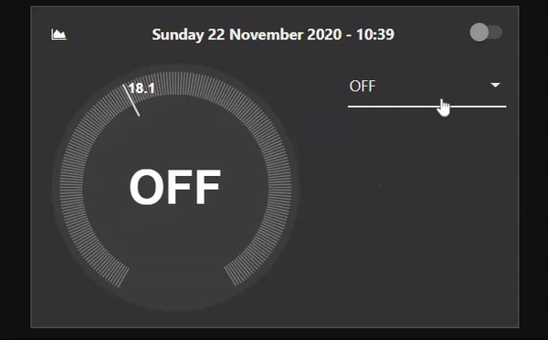

## Features
This widget allows you to control the **climate** element of the **Home Assistant**, expanding its functionality.

* Three different options for setting up the thermostat:
  * Week Scheduler (with Away mode)
  * Countdown
  * Manual
* State report through a NEST style thermostat:
  * OFF
  * ON 
    * Idle
    * Heat
    * Away mode (that limits the maximum temperature) 
* Chart

## Screenshots
### Home:
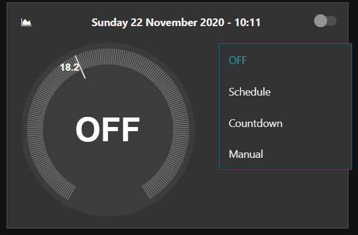

### Week Scheduler:
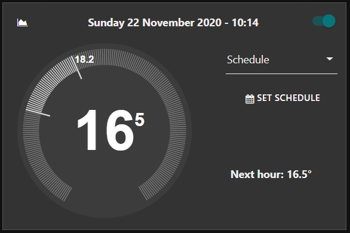

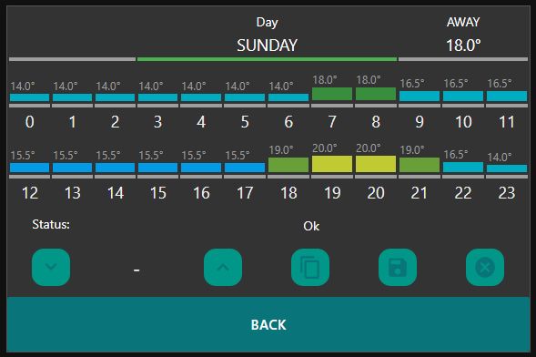

### Countdown:
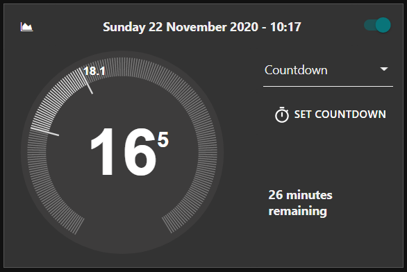

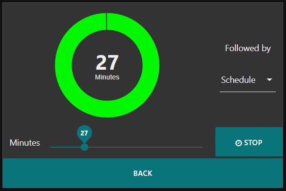

### Manual:
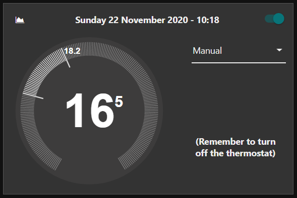

### State report:
#### Off:
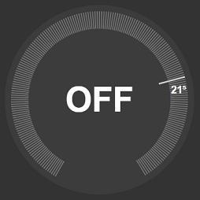

#### On:
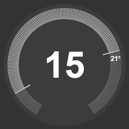

#### Heat:
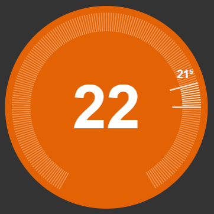

#### Away:
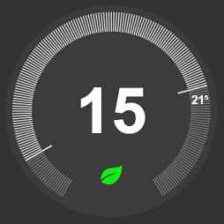

### Chart:
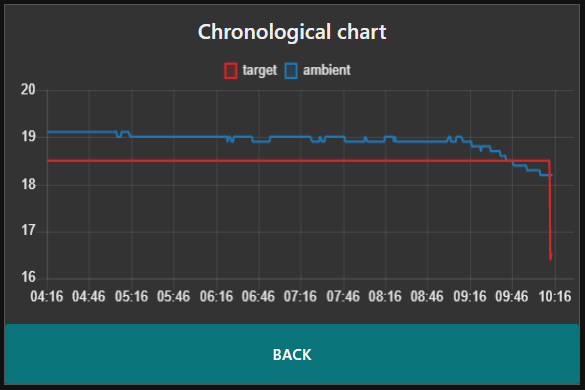

## How to install
1. Install [*node-red-contrib-mytimeout*](https://flows.nodered.org/node/node-red-contrib-mytimeout) 

2. Download the flow, then go to your node-red application and press **`import`** > **`cliboard`** and finally select the file downloaded.
   Two versions available:
   * [flowEN.json](flowEN.json) --> English language
   * [flowIT.json](flowIT.json) --> Italian language

3. Modify the *Properties* **Server** (ex: Home Assistant) and **Entity Id** (ex: climate.termostato) of the following nodes:
   * Climate
   * Away from Alarm
   * svc: climate:set_temperature
   * svc: climate:turn_off
   * svc: climate:turn_on

   These nodes are highlighted in the flow by the comment *"Set this"* (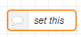).

4. Deploy and enjoy!

## Changelog
### v3.0
* Improve the user interface
* Add Countdown mode
* Add Manual mode
* Add Chart
* Implement 0.1 degree steps in the NEST style thermostat

### v1.0
Initial commit

## Potential future improvements
* Schedule mode with 0.1 degree steps
* Improve the graphics component (currently: only horizontal and no-resizing)
