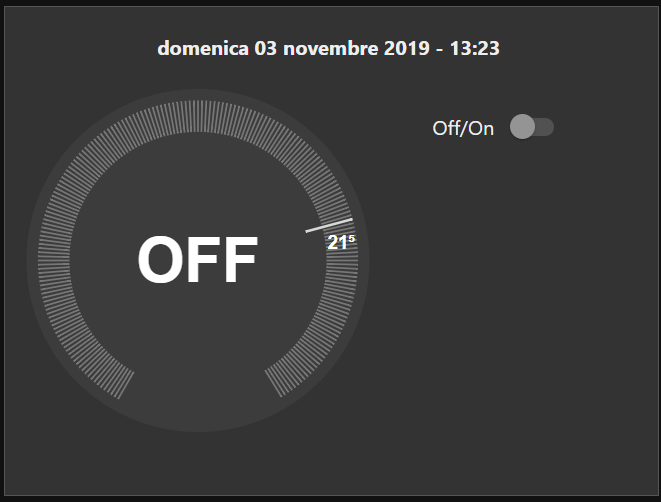
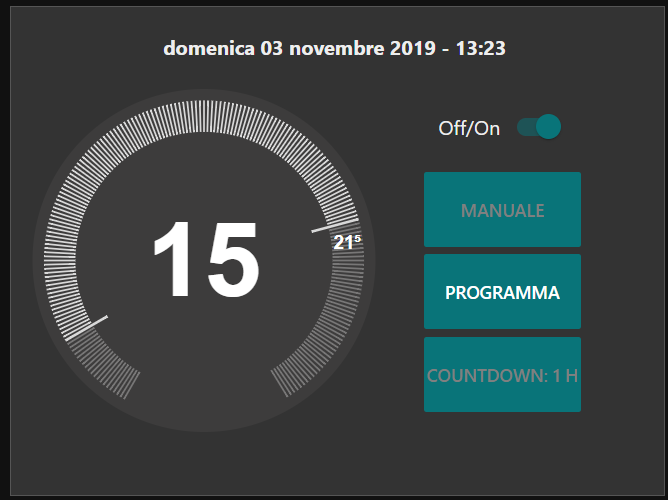
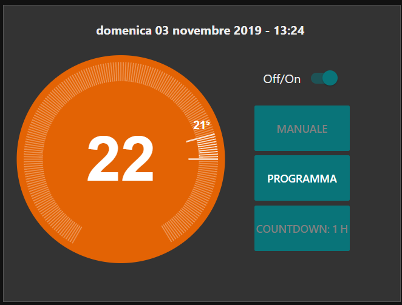
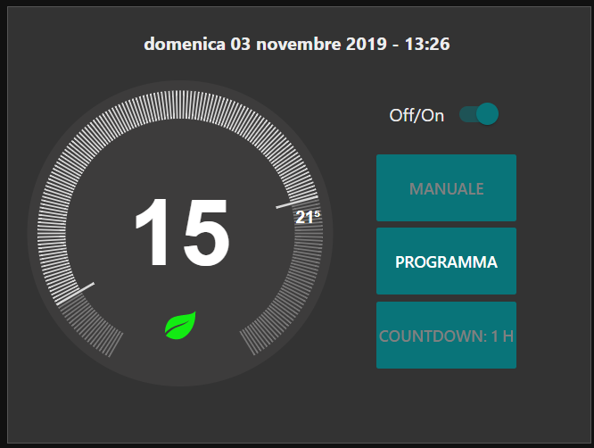
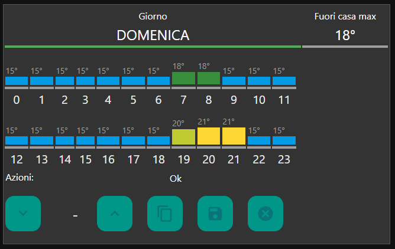

# NEST style thermostat with temperature week scheduler
Dashboard widget for Node-RED - Hass.io Ready

## Original projects
This project is an integration of these:
* [NEST style thermostat Dashboard widget for Node-red](https://github.com/automatikas/Node-red-Nest-thermostat)
* [A Thermostat Weekend](https://tech.scargill.net/tag/a-node-red-dashboard-thermostat-in-the-making/)
* [Temperature/ON-OFF Week Scheduler UI-Template Node-Red Dashboard](https://flows.nodered.org/flow/65f411e9e37745a4bbeef5926d052c97)

## Screenshots
### Off:

### On:

### Heat:

### Away:

### Scheduler:

## How to install
Download the file flow.json, then go to your node-red application and press **`import`** > **`cliboard`** and finally select the file saved.

## How to use
Modify the following nodes configuring the data source (ex: Home Assistant server):
* Climate
* Away from Alarm
* svc: climate:set_temperature
* svc: climate:turn_off
* svc: climate:turn_on

## Features
* Thermostat status: OFF, ON with target temperature, Heat, Away mode (limits the maximum temperature) 
* Thermostat control: Off or On by scheduler
* Week Scheduler

## TODO
* Manual and countdown modes
* Improve the graphics component (currently: only horizontal and with problems in resizing)
